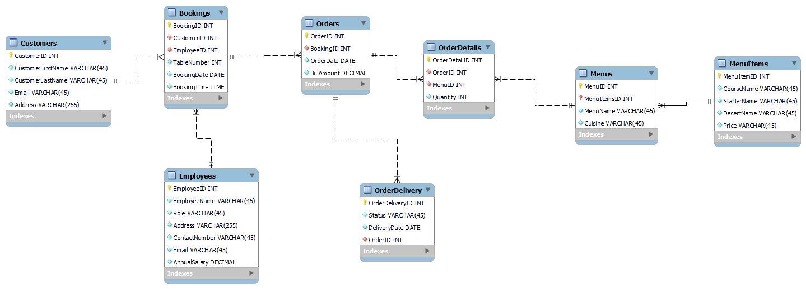

# LittleLemon Restaurant - MySQL Database Solution
**Introduction**

Welcome to the LittleLemon Restaurant MySQL Database Project! This project provides a fully functional and optimized database solution for managing restaurant operations. The database has been designed to handle key functionalities like customer orders, menu management, employee management, and inventory tracking.

The project leverages MySQL to implement advanced features such as stored procedures, views, and indexing to enhance database performance and maintain a smooth workflow.

**ERD Diagram**

Below is the Entity-Relationship Diagram (ERD) representing the structure of the database, illustrating the relationships between key entities such as Customers, Orders, Employees, and Menus:




**Features and Functionality**

+ Database Design: A carefully structured relational database that ensures data consistency and normalization.
+ Optimization Techniques: Indexing and query optimization techniques for improved performance.
+ Stored Procedures: Implemented to automate tasks such as retrieving maximum quantities and canceling orders.
+ Views: Simplified access to complex data queries through views for easier reporting.
+ Triggers: Automatic triggers that handle events such as order processing and inventory updates.
+ Data Security: Role-based permissions implemented for employees and managers, ensuring secure access to sensitive data.

**Procedures**

+ GetMaxQuantity Procedure: This procedure retrieves the maximum quantity of an item in any order. It is used to provide insights into high-demand menu items.
+ CancelOrder Procedure: A procedure that allows the cancellation of an order, updating the order status and performing necessary rollback actions (e.g., updating inventory if needed).

**Views**

+ OrdersView: This view provides an easy-to-read summary of all customer orders, showing order details such as date, menu items ordered, and total bill amount. It simplifies order tracking and report generation.
  

**Getting Started**

To set up the LittleLemon restaurant database on your local machine, follow these steps:

1. Install MySQL on your local machine if you haven't already.
2. Clone the repository:
```
git clone https://github.com/your-username/LittleLemon-Database.git
```
2. Import the SQL schema and data:
```
mysql -u username -p password < littlelemon-database.sql
```
3. Execute the stored procedures and views:

```
mysql -u username -p password < week2_tasks.sql
```

**Database Schema Overview**
+ Customers: Stores customer details like first and last names, email, and address.
+ Employees: Stores employee information, including role, contact info, and salary.
+ Orders: Manages customer orders, including order date, booking ID, and bill amount.
+ OrderDetails: Contains detailed information about each order, including the menu items and quantities ordered.
+ Menus: Lists available food items with attributes like cuisine type, price, and menu course.
+ OrderDelivery: Tracks the delivery status of each order, including delivery dates and statuses.

**Technologies Used**

+ MySQL: Relational Database Management System.
+ SQL: Used for writing stored procedures, views, and queries.
+ MySQL Workbench: Used for managing the database.
+ Draw.io: Used for designing the database schema

**Optimization Techniques**

+ Indexing: Applied to frequently queried columns to speed up data retrieval.
+ Query Optimization: Queries are fine-tuned for efficient performance.
+ Partitioning: Used for managing large data tables and reducing query execution time.

**Future Enhancements**

+ Front-End Integration: This database can be integrated with a front-end system to provide a complete restaurant management solution.
+ Enhanced Reporting: Additional views and stored procedures can be added for advanced reporting and analytics.

**Contact Information**

+ For any inquiries or further collaboration, feel free to reach out:

    + Email: shrirajan331@gmail.com
    + LinkedIn: Shriraam Nagarajan

Thank you for checking out this project!😊
